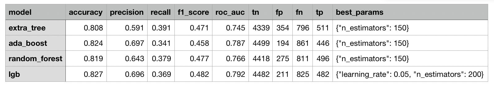

# Project Overview

The project implements an application to predict the next payment(whether a customer is able to pay the full balance) of credit card users based on 6 months historical payment and spending records.

# Methodology
  

## Requirements
The prediction is a binary classification task which produces outputs as 0 and 1.

0 - The customer will pay the full balance

1 - The customer will not pay the full balance

### Out of scope
The data set doesn't contain any late payment information so late payment will not be considered.

#### Application requirements

##### Automate ML
-  Run exploratory analysis such as feature importance to aid feature selection.
-  Use grid search to find the best hyper-parameters of different models.
-  Automate training and testing process and visualize the results.

##### Simple to Use
- Simply use the config template to create tasks then run the job to get the best results.
- Provide interim analysis results. e.g. Feature engineering, AUC score, histograms.

##### Open/Close Principle - Easy to expand
- Model training and reporting functions/code are closed to modification in future model expansion process.
- Adding new models only requires modifications in config files.

## Model Evaluation and Validation
The source data has the following natures:
1. Contains both numerical and categorical features
2. Non-linear correlation or no correlation between some features. e.g. Marriage and Education, age and balance.
3. The prediction is a binary class
4. The predictions(output classes) in the source data are imbalanced. More positive values than negative values.
5. The dataset contains only 6 historical records of each customer.
6. Statistical analysis shows no significant important feature(s) to the prediction.
      

Based on the nature of the data and statistical analysis result, the following models are good options to this task:

#### Ensemble tree models 
The models combines several decision trees to produce better predictive performance than utilizing a single decision tree. The main principle behind the ensemble models is that a group of weak learners come together to form a strong learner.

techniques to perform ensemble decision trees:
1. Bagging
   Random Forest

2. Gradient Boosting
   Xgboost, LightGBM and Catboost

#### Justification
According to the result of cross validation with grid search, Xgboost, LightGBM and Catboost achieved similar performance, with Accuracy > 0.825, AUC > 0.68
The draw back is that gradient boosting models require more  hyperparameter tuning to find the optimal values.

Random forest achieved a slightly lower accuracy: 0.82 
This indicates that Gradient Boosting models has better performance than Random forest classifier. Gradient boost models support choosing various loss functions and reduce errors accordingly.
 

## Conclusion
Considering the skewness of the source data and the limited features it contains. The models achieved acceptable predictions. Hyperparameter tuning shows that a small learning rate(0.01 ~ 0.02 in this dataset) with large iterations/number of trees (100 ~ 200) gave a good result.

## Improvements
Classes can be balanced while creating training and testing dataset. This may result better accuracy. Such functionality will be implemented in the next update.

Grid search uses discrete hyperparameter values in the manually defined search domain. Some hyperparameters' optimal value could be missed. Different tunners such as TPE, Random Search and Anneal can be tested to support continuos values in search space.
##### Reference: 
https://github.com/microsoft/nni/blob/master/docs/en_US/Tuner/BuiltinTuner.md#

## Code structure and explanations 
- The `main()` function creates an instance/object of `Task` class.
- `Task` class invokes `Classifier` class and creates an instance of `Classifier` class to run the classification algorithms.
- `Classifier` class has a group of methods to read `configs` and `hyperparameter search space` from `Task` class and use its methods to train the model and generate report.
- Supported algorithms are `Random Forest`, `Etra Tree`, `Ada Boost`, `Gradient Boost`, `Xgboost`, `LightGBM`
- `config.yml` contains the configuration for task resource. e.g. task name, file and directory locations and models to use.
- `search_space.yml` contains the hyperparameters for model training with `grid search` algorithm. All parameters are configurable to customize the `search space`.
- `Metrics` are saved in `reports` directory, under the task folder, including `Model_metrics`  -- best `accuracy` and `AUC`scores of all the models, `prediction results` and `feature importance` of individual models,  `histograms` of `predicted probability` of `each class/label` for each model. 
- `Trained models` with best scores are saved in `Models` directory for future use. 
- `EDA reports` contains an example of `Exploratory Data Analysis`, including `feature engineering`, `feature importance`, `feature correlation` and other analysis with visualizations to present results.
- `Notebooks` are example source `jupyter notebook` files of `EDA` and `model training`. 

## Data source
- data.csv
* This application aims at predicting customers’ default credit card payments.
Attribute Information:
* Default payment (Yes = 1, No = 0), as the response variable.
* X1: Amount of the given credit (NT dollar): it includes both the individual consumer credit and his/her family (supplementary) credit.
* X2: Gender (1 = male; 2 = female).
* X3: Education (1 = graduate school; 2 = university; 3 = high school; 4 = others).
* X4: Marital status (1 = married; 2 = single; 3 = others).
* X5: Age (year).
* X6 - X11: History of past payment.
* X6 = the repayment status in September, 2005;
* X7 = the repayment status in August, 2005; . . .;X11 = the repayment status in April, 2005
* The measurement scale for the repayment status is: -1 = pay duly; 1 = payment delay for one month; 2 = payment delay for two months; . . .; 8 = payment delay for eight months; 9 = payment delay for nine months and above.
* X12-X17: Amount of bill statement (NT dollar). X12 = amount of bill statement in September, 2005;
* X13 = amount of bill statement in August, 2005; . . .;
* X17 = amount of bill statement in April, 2005.
* X18-X23: Amount of previous payment (NT dollar). X18 = amount paid in September, 2005; X19 = amount paid in August, 2005; . . .;X23 = amount paid in April, 2005.

# Install & Verify
## Install dependencies with pip
`pip install -r requirements.txt`

## Packaging
Refer to this link to make an installable python project package.

https://packaging.python.org/tutorials/packaging-projects/

# Adding Configurations
### Before running the program:

### Edit your configurations in config/config.yml

**Example:**

**MODEL_DIR:** `'../models'`

**MODEL_LIST:**

  `- 'RandomForest'`

  `- 'LightGBM'`

  `- 'AdaBoost'`

  `- 'ExtraTree'`

**DATA_FILE_PATH:** `'../data/raw/credits.csv'`

**REPORT_DIR:** `'../reports'`

**FIGURES_DIR:** `'../reports/figures'`

**N_CV_FOLDS:** `5`

**TEST_RATIO:** `0.2`

**COL_LABEL:** `'default payment next month'`

**DENSE_FEATURES:**

  `- 'LIMIT_BAL'`

 `- 'AGE'`

**SPARSE_FEATURES:**

  `- 'SEX'`

 ` - 'EDUCATION'`

 `- 'MARRIAGE'`

### Edit your grid search configs in config/space_search.yml

**Example:**

**RANDOM_FOREST:**

   **max_features:**

   `- 0.6`

   `- 1.0`

   **max_depth:**

   `- 6`

   `- 10`

   **n_estimators:**

   `- 50`

   `- 100`

# Run program
**For each task, please create a folder with task name under `config` directory (e.g. `config/credit`) then put `config.yml` and `search_space.yml` in this directory.**

**Config templates are available in `config/config_templates` directory**

**Put the data file under `data/raw/` directory.**

**After adding configs to config.yml and search_space.yml, run the application by issuing the following command:**

`python3 main.py <task name> <data file name>`

Example command:

`python3 main.py credit  credits.csv`

**The results are located in `Reports/<task name>`  and  `Reports/figures/<task name>/` directories**

**Models with best results are located in `models` directory**

## Adding new Models
After installing new models and algorithms, just add the new model in `import.py` and `config.yml` to load the model in the tasks.

- Add model package in `import_models.py`.
  * Example: `from sklearn import <model_name>`
- Add new models in the config files - `config.yml: MODEL_LIST`
- Define what models to run by the task in `config.yml: RUN_MODELS`

## Testing
 Test cases are located in `test` directory with sample config files.
 
#### Unit test 
 
 1. Put testing config files in to `test/unit_test/` directory.
 2. Run test with the following commands:
   
    `cd test/unit_test`

    `python3 unit_test.py`

 #### Config test:
 1. Put testing config files in `test/config_test/` directory.
 2. Run test with the following commands:
   
    `cd test/config_test`

    `python3 config_test.py`

Note: Config test will only test loading and reading configuration files and validate the values of hyperparameters.
